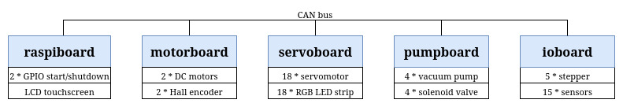

# MonobotSoftware2025

Minimal yet complete software for [Eurobot](https://www.eurobot.org/) competition



To clone this repo:

```bash
git clone --recurse-submodules --jobs 8 https://github.com/monowii/MonobotSoftware2025
```

## STM32 software in C++ with modm for ioboard, motorboard, pumpboard, servoboard

1. Install modm requirements

[modm complete installation guide](https://modm.io/guide/installation/)

```bash
sudo apt install python3 python3-pip scons git libncursesw6 openocd
pip3 install modm
wget -O- https://github.com/xpack-dev-tools/arm-none-eabi-gcc-xpack/releases/download/v14.2.1-1.1/xpack-arm-none-eabi-gcc-14.2.1-1.1-linux-x64.tar.gz | sudo tar xz -C /opt/
export PATH="/opt/xpack-arm-none-eabi-gcc-14.2.1-1.1/bin:$PATH"
```

2. Compile and flash

```bash
lbuild build # generate modm library (call only once, or if you modify project.xml)
scons -j8 # compile
scons program # Upload the firmware with st-link
```

if upload doesn't works on nucleo_l432kc:
- edit `servoboard/modm/openocd.cfg`
- add after `source [find board/stm32l4discovery.cfg]` the following line: `reset_config none`

if upload doesn't works on stm32f446re boards:
- hold the reset button when `scons program`

## Python3 software for raspiboard

check raspiboard [README](raspiboard/README.md)

## ESP32 software used for pamiboard

(pamiboard is an independant miniature robot)

Linux users have to install udev rules for PlatformIO supported boards/devices:
- https://docs.platformio.org/en/stable//core/installation/udev-rules.html
- https://docs.espressif.com/projects/esp-idf/en/latest/esp32/get-started/establish-serial-connection.html

```bash
curl -fsSL https://raw.githubusercontent.com/platformio/platformio-core/develop/platformio/assets/system/99-platformio-udev.rules | sudo tee /etc/udev/rules.d/99-platformio-udev.rules
sudo usermod -a -G dialout $USER
# then reboot host machine
```